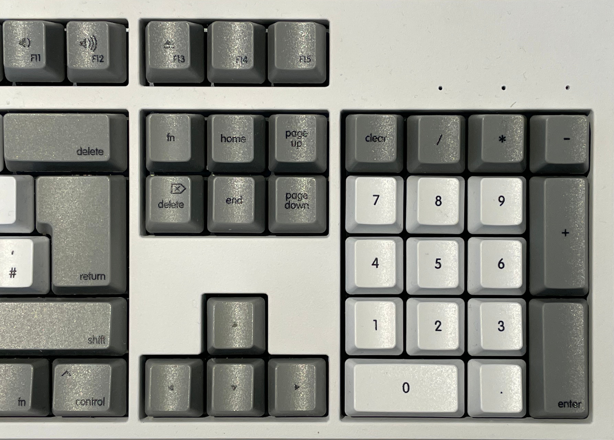

# wasd-mac-german-layout

Just can't believe that there isn't something around for ze poor german mac user... or I am just too stupid to google it.
Anyways - may it be of help to others, will add images when it's here to show how it turns out in real life.

## NOTE
The guy from WASD contacted me and I had to send him a pdf version as inkscape did something funny importing with the latest version (1.something).

But this is how it came out:

Originally I wanted white font color on the darker caps, but seem to have forgotten it, and it's ... ok.